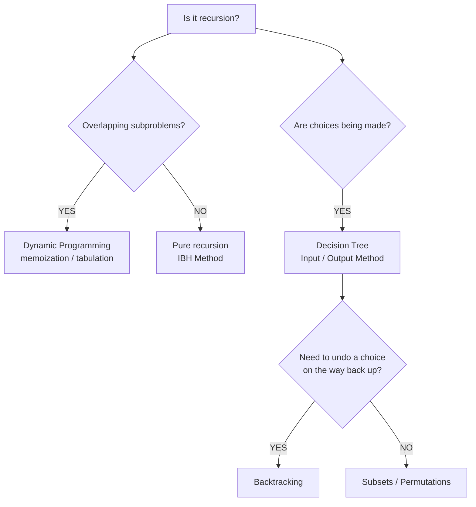
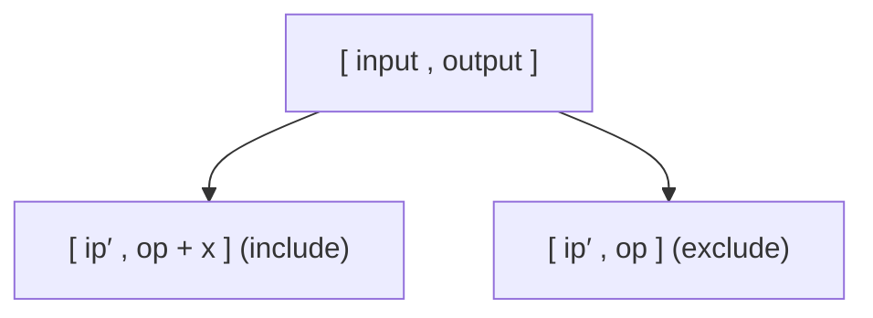

# Recursion — Implementation Notes

> Deep-dive, implementation-grade notes on **Aditya Verma's Recursion playlist** — exact base conditions, hypothesis/induction logic, and decision-tree branching for every problem, with runnable C++.

[](https://www.youtube.com/watch?v=kHi1DUhp9kM)


---

## Table of Contents

- [Part 1 — Mental Models](#part-1--high-level-mental-models--frameworks)
  - [Choosing an approach](#choosing-an-approach)
  - [Method 1: IBH](#method-1-ibh-induction--base-condition--hypothesis)
  - [Method 2: Input / Output](#method-2-input--output-method-decision-trees)
- [Part 2 — Pattern A: IBH Problems](#part-2--pattern-a-ibh-problems-arrays-stacks-numbers)
  1. [Sort an Array](#1-sort-an-array-using-recursion)
  2. [Sort a Stack](#2-sort-a-stack-using-recursion)
  3. [Reverse a Stack — O(1) space](#3-reverse-a-stack-using-o1-extra-space)
  4. [Delete Middle of a Stack](#4-delete-middle-element-of-a-stack)
  5. [K-th Symbol in Grammar](#5-k-th-symbol-in-grammar-leetcode-779)
  6. [Tower of Hanoi](#6-tower-of-hanoi)
- [Part 2 — Pattern B: Decision Tree Problems](#part-2--pattern-b-decision-tree-problems-subsets-permutations-constraints)
  7. [Generate All Subsets](#7-generate-all-subsets--print-power-set)
  8. [Print Unique Subsets](#8-print-unique-subsets)
  9. [Permutation with Spaces](#9-permutation-with-spaces)
  10. [Permutation with Case Change](#10-permutation-with-case-change)
  11. [Letter Case Permutation](#11-letter-case-permutation-leetcode-784)
  12. [Balanced Parentheses](#12-generate-balanced-parentheses-leetcode-22)
  13. [N-bit Binary, 1s > 0s](#13-n-bit-binary-numbers-having-more-1s-than-0s-in-all-prefixes)
  14. [Josephus Problem](#14-josephus-problem-game-of-death-in-a-circle)
- [Part 3 — Cheat Sheet](#part-3--cheat-sheet--time-complexities)

---

## Part 1 — High-Level Mental Models & Frameworks

### Choosing an approach



### Method 1: IBH (Induction – Base Condition – Hypothesis)

Use IBH when input size decreases linearly (N → N−1) — stacks, arrays, linked lists, trees.

1. **Hypothesis** — design `solve(input)` and *assume* it correctly solves size N−1.
2. **Induction** — write the single logic step that converts the N−1 answer into the N answer.
3. **Base condition** — the smallest valid input, or first invalid input. Return directly, no recursive call.

### Method 2: Input / Output Method (Decision Trees)

Use when a choice exists at every step (include/exclude, uppercase/lowercase, space/no space).



- **Recursive signature:** `void solve(string ip, string op)`
- **Base case:** `if (ip.length() == 0) { print(op); return; }`
- **Branching strategy:** process `ip[0]`, pass `ip.substr(1)` as the new input to both recursive calls.

---

## Part 2 — Pattern A: IBH Problems (Arrays, Stacks, Numbers)

### 1. Sort an Array using Recursion

`Time: O(N²)` · `Space: O(N)`

- **Goal:** sort an unsorted array recursively, no iterative loops.
- **Hypothesis:** `sort(v)` sorts vector `v`. So `sort` on `v` after popping the last element sorts the remaining N−1.
- **Induction:** take the popped element `val` and insert it into its correct position in the now-sorted vector via `insert(v, val)`.

```cpp
void insert(vector<int>& v, int temp) {
    // Base Case for Insertion: Empty vector OR last element <= temp
    if (v.size() == 0 || v[v.size() - 1] <= temp) {
        v.push_back(temp);
        return;
    }
    int val = v[v.size() - 1];
    v.pop_back();
    insert(v, temp); // Recursive insertion call
    v.push_back(val);
}

void sortArray(vector<int>& v) {
    if (v.size() <= 1) return; // Base Condition

    int temp = v[v.size() - 1];
    v.pop_back();
    sortArray(v);       // Hypothesis (Sort N-1)
    insert(v, temp);    // Induction (Insert Nth element)
}
```

### 2. Sort a Stack using Recursion

`Time: O(N²)` · `Space: O(N)`

Same logic as array sorting, using stack primitives (`top()`, `pop()`, `push()`).

```cpp
void insert(stack<int>& st, int temp) {
    if (st.empty() || st.top() <= temp) {
        st.push(temp);
        return;
    }
    int val = st.top();
    st.pop();
    insert(st, temp);
    st.push(val);
}

void sortStack(stack<int>& st) {
    if (st.size() <= 1) return;

    int temp = st.top();
    st.pop();
    sortStack(st);
    insert(st, temp);
}
```

### 3. Reverse a Stack using O(1) Extra Space

`Time: O(N²)` · `Space: O(N)`

- **Goal:** reverse a stack in-place using only call-stack frame memory.
- **Hypothesis:** `reverse(st)` reverses a stack of size N−1.
- **Induction:** put the popped top element `temp` at the **bottom** of the reversed stack via `insertAtBottom(st, temp)`.

```cpp
void insertAtBottom(stack<int>& st, int ele) {
    if (st.empty()) {
        st.push(ele);
        return;
    }
    int temp = st.top();
    st.pop();
    insertAtBottom(st, ele);
    st.push(temp);
}

void reverseStack(stack<int>& st) {
    if (st.size() <= 1) return;

    int temp = st.top();
    st.pop();
    reverseStack(st);
    insertAtBottom(st, temp);
}
```

### 4. Delete Middle Element of a Stack

`Time: O(N)` · `Space: O(N)`

- **Problem definition:** `k = ⌊size / 2⌋ + 1` (1-indexed position from the top).
- **Base condition:** `if (k == 1) { st.pop(); return; }`

```cpp
void deleteMiddle(stack<int>& st, int k) {
    if (st.empty()) return;
    if (k == 1) {
        st.pop(); // Remove middle element
        return;
    }

    int temp = st.top();
    st.pop();
    deleteMiddle(st, k - 1); // Reduce k toward target
    st.push(temp);           // Re-insert during unwinding
}
```

### 5. K-th Symbol in Grammar (LeetCode 779)

`Time: O(N)` · `Space: O(N)`

- **Problem:** Row 1 is `0`. Every next row replaces `0` with `01` and `1` with `10`.
- **Observations:**
  1. Row N has length `2^(N-1)`.
  2. The **first half** of row N is identical to row N−1.
  3. The **second half** of row N is the bitwise complement of row N−1.

```cpp
int kthGrammar(int n, int k) {
    if (n == 1 && k == 1) return 0; // Base condition

    int mid = pow(2, n - 2); // Length of previous row / half of current row

    if (k <= mid) {
        return kthGrammar(n - 1, k);
    } else {
        return !kthGrammar(n - 1, k - mid);
    }
}
```

### 6. Tower of Hanoi

`Time: O(2ᴺ)` · `Space: O(N)`

- **Goal:** move N disks from Source `S` to Destination `D` using Auxiliary `A`.
- **Steps:**
  1. Move N−1 disks from `S` to `A`, using `D`.
  2. Move the N-th disk directly from `S` to `D`.
  3. Move N−1 disks from `A` to `D`, using `S`.

```cpp
void solve(int n, int s, int d, int a, long long& count) {
    count++;
    if (n == 1) {
        cout << "move disk " << n << " from rod " << s << " to rod " << d << endl;
        return;
    }
    solve(n - 1, s, a, d, count);
    cout << "move disk " << n << " from rod " << s << " to rod " << d << endl;
    solve(n - 1, a, d, s, count);
}
```

---

## Part 2 — Pattern B: Decision Tree Problems (Subsets, Permutations, Constraints)

### 7. Generate All Subsets / Print Power Set

`Time: O(2ᴺ)` · `Space: O(N)`

Choices for `ip[0]`: exclude, or include in the output.

```cpp
void printSubsets(string ip, string op) {
    if (ip.length() == 0) {
        cout << op << " ";
        return;
    }

    string op1 = op;          // Choice 1: Exclude
    string op2 = op + ip[0];  // Choice 2: Include

    string next_ip = ip.substr(1);

    printSubsets(next_ip, op1);
    printSubsets(next_ip, op2);
}
```

### 8. Print Unique Subsets

`Time: O(2ᴺ)` · `Space: O(N)`

- **Problem:** input string may contain duplicate characters (e.g. `"aab"`).
- **Fix:** store results in an ordered `set<string>` (or `unordered_set<string>`) to auto-deduplicate.

```cpp
void solve(string ip, string op, set<string>& res) {
    if (ip.length() == 0) {
        res.insert(op);
        return;
    }
    string op1 = op;
    string op2 = op + ip[0];
    string next_ip = ip.substr(1);

    solve(next_ip, op1, res);
    solve(next_ip, op2, res);
}
```

### 9. Permutation with Spaces

`Time: O(2ᴺ)` · `Space: O(N)`

- **Input:** `"ABC"` → **Output:** `A_B_C`, `A_BC`, `AB_C`, `ABC`.
- **Key insight:** the first character `ip[0]` is always pushed to `op` directly; the decision tree starts from index 1.

```cpp
void solve(string ip, string op) {
    if (ip.length() == 0) {
        cout << op << endl;
        return;
    }

    string op1 = op + "_" + ip[0]; // Include space
    string op2 = op + ip[0];       // Do not include space

    string next_ip = ip.substr(1);

    solve(next_ip, op1);
    solve(next_ip, op2);
}

// Initial Call:
// string ip = "ABC";
// solve(ip.substr(1), string(1, ip[0]));
```

### 10. Permutation with Case Change

`Time: O(2ᴺ)` · `Space: O(N)`

- **Input:** `"ab"` → **Output:** `ab`, `aB`, `Ab`, `AB`.

```cpp
void solve(string ip, string op) {
    if (ip.length() == 0) {
        cout << op << endl;
        return;
    }

    string op1 = op + (char)tolower(ip[0]);
    string op2 = op + (char)toupper(ip[0]);
    string next_ip = ip.substr(1);

    solve(next_ip, op1);
    solve(next_ip, op2);
}
```

### 11. Letter Case Permutation (LeetCode 784)

`Time: O(2ᴺ)` · `Space: O(N)`

- **Input:** `"a1b2"` — handle both alphabets (2 choices) and digits (1 choice).

```cpp
void solve(string ip, string op, vector<string>& res) {
    if (ip.length() == 0) {
        res.push_back(op);
        return;
    }

    if (isalpha(ip[0])) {
        string op1 = op + (char)tolower(ip[0]);
        string op2 = op + (char)toupper(ip[0]);
        string next_ip = ip.substr(1);
        solve(next_ip, op1, res);
        solve(next_ip, op2, res);
    } else {
        string op1 = op + ip[0]; // Digit: single branch
        string next_ip = ip.substr(1);
        solve(next_ip, op1, res);
    }
}
```

### 12. Generate Balanced Parentheses (LeetCode 22)

`Time: O(Cₙ) ≈ O(4ᴺ / N^1.5)` · `Space: O(N)`

- **Given N pairs of parentheses**, generate all valid combinations.
- **Constraints for the decision tree:**
  - `open > 0` — can always add `(`.
  - `close > open` — can add `)` only if the remaining close count is strictly greater than the remaining open count.

```cpp
void solve(int open, int close, string op, vector<string>& res) {
    if (open == 0 && close == 0) {
        res.push_back(op);
        return;
    }

    // Choice 1: Add Open Bracket
    if (open != 0) {
        string op1 = op + "(";
        solve(open - 1, close, op1, res);
    }

    // Choice 2: Add Close Bracket
    if (close > open) {
        string op2 = op + ")";
        solve(open, close - 1, op2, res);
    }
}
```

### 13. N-bit Binary Numbers Having More 1s than 0s in All Prefixes

`Time: O(2ᴺ)` · `Space: O(N)`

- **Constraints for the decision tree:**
  - Can always add `1`.
  - Can add `0` **only if** `ones > zeros`.

```cpp
void solve(int ones, int zeros, int n, string op) {
    if (n == 0) {
        cout << op << " ";
        return;
    }

    // Choice 1: Always valid to append '1'
    string op1 = op + "1";
    solve(ones + 1, zeros, n - 1, op1);

    // Choice 2: Append '0' only if ones > zeros condition holds
    if (ones > zeros) {
        string op2 = op + "0";
        solve(ones, zeros + 1, n - 1, op2);
    }
}
```

### 14. Josephus Problem (Game of Death in a Circle)

`Time: O(N²)` (vector erase) · `Space: O(N)`

- **Problem:** N people stand in a circle (`0` to `N-1`). Kill every K-th person until 1 survivor remains.
- **Observation:** after killing the K-th person, the array indices shift.

```cpp
void solve(vector<int>& person, int k, int index, int& ans) {
    if (person.size() == 1) {
        ans = person[0]; // Survivor
        return;
    }

    // Calculate index of person to be killed
    index = (index + k) % person.size();
    person.erase(person.begin() + index);

    solve(person, k, index, ans);
}

int findTheWinner(int n, int k) {
    vector<int> person;
    for (int i = 0; i < n; i++) person.push_back(i + 1); // 1-indexed
    int ans = -1;
    solve(person, k - 1, 0, ans);
    return ans;
}
```

---

## Part 3 — Cheat Sheet & Time Complexities

| Category | Problem | Time Complexity | Space Complexity (Call Stack) |
|---|---|---|---|
| IBH | Sort Array / Stack | `O(N²)` | `O(N)` |
| IBH | Reverse Stack | `O(N²)` | `O(N)` |
| IBH | Delete Middle Stack | `O(N)` | `O(N)` |
| IBH | K-th Symbol Grammar | `O(N)` | `O(N)` |
| IBH | Tower of Hanoi | `O(2ᴺ)` | `O(N)` |
| Input/Output | Subsets / Subsequences | `O(2ᴺ)` | `O(N)` |
| Input/Output | Permutations (Spaces/Case) | `O(2ᴺ)` | `O(N)` |
| Input/Output | Balanced Parentheses | `O(Cₙ) ≈ O(4ᴺ/N^1.5)` | `O(N)` |
| Input/Output | Josephus Problem | `O(N²)` (vector erase) | `O(N)` |

---

**Source:** [Aditya Verma — Recursion Playlist](https://www.youtube.com/watch?v=kHi1DUhp9kM)
